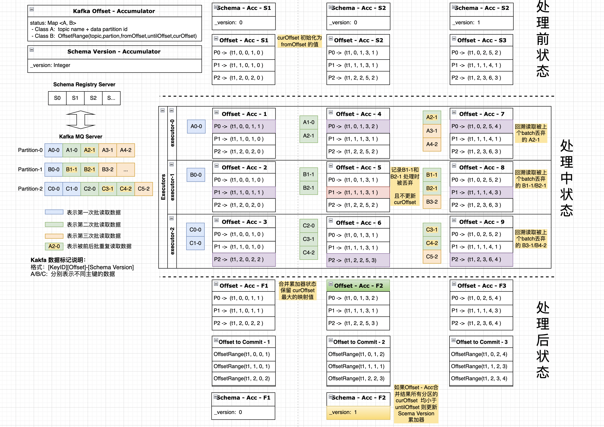

# Spark Streaming 读取 Kafka 存储 Iceberg 数据湖

基于 Spark Streaming / Kafka Connect / Debezium /Confluent Schema Register Server / Apache Avro / Iceberg 等相关组建,将数据实时同步到 Iceberg 中。  
选择 Hadoop Catalog 进行数据存储，然后在基于存储的数据创建 Hive 外表
支持 Iceberg 表结构自适应变动 （添加列/ 删除列）- 修改列暂不支持

## 数据格式示列
## 数据格式示列
```shell
# 原始 Avro 数据
partition = 0, offset = 0, key={"ID1": 1005, "ID2": "A"},value={"before": null, "after": {"ID1": 1005, "ID2": "A", "C1": "V3-1", "C2": 5000, "C5": "S4-4", "C4": 4000, "C3": null, "CREATE_TIME": 1646101923000, "UPDATE_TIME": 1646296793000}, "source": {"version": "1.8.0.Final", "connector": "mysql", "name": "test", "ts_ms": 1646297167000, "snapshot": "false", "db": "db_gb18030_test", "sequence": null, "table": "tbl_test_1", "server_id": 1, "gtid": "e45b718e-906f-11ec-89e3-0242c0a8640a:1375", "file": "mysql-bin.000021", "pos": 46951, "row": 0, "thread": null, "query": null}, "op": "c", "ts_ms": 1646297167652, "transaction": {"id": "e45b718e-906f-11ec-89e3-0242c0a8640a:1375", "total_order": 1, "data_collection_order": 1}}, schemaHash=-1269925545 
partition = 0, offset = 1, key={"ID1": 1005, "ID2": "A"},value={"before": {"ID1": 1005, "ID2": "A", "C1": "V3-1", "C2": 5000, "C5": "S4-4", "C4": 4000, "C3": null, "CREATE_TIME": 1646101923000, "UPDATE_TIME": 1646296793000}, "after": {"ID1": 1005, "ID2": "A", "C1": "V3-1", "C2": 5000, "C5": "S4-421", "C4": 4000, "C3": null, "CREATE_TIME": 1646101923000, "UPDATE_TIME": 1646391849000}, "source": {"version": "1.8.0.Final", "connector": "mysql", "name": "test", "ts_ms": 1646391849000, "snapshot": "false", "db": "db_gb18030_test", "sequence": null, "table": "tbl_test_1", "server_id": 1, "gtid": "e45b718e-906f-11ec-89e3-0242c0a8640a:1419", "file": "mysql-bin.000021", "pos": 128416, "row": 0, "thread": null, "query": null}, "op": "u", "ts_ms": 1646391966649, "transaction": {"id": "e45b718e-906f-11ec-89e3-0242c0a8640a:1419", "total_order": 1, "data_collection_order": 1}}, schemaHash=-1269925545 
partition = 0, offset = 2, key={"ID1": 1005, "ID2": "A"},value={"before": {"ID1": 1005, "ID2": "A", "C1": "V3-1", "C2": 5000, "C5": "S4-4", "C4": 4000, "C3": null, "CREATE_TIME": 1646101923000, "UPDATE_TIME": 1646296793000}, "after": {"ID1": 1005, "ID2": "A", "C1": "V3-1", "C2": 5000, "C5": "S4-421", "C4": 4000, "C3": null, "CREATE_TIME": 1646101923000, "UPDATE_TIME": 1646391849000}, "source": {"version": "1.8.0.Final", "connector": "mysql", "name": "test", "ts_ms": 1646391849000, "snapshot": "false", "db": "db_gb18030_test", "sequence": null, "table": "tbl_test_1", "server_id": 1, "gtid": "e45b718e-906f-11ec-89e3-0242c0a8640a:1419", "file": "mysql-bin.000021", "pos": 128416, "row": 0, "thread": null, "query": null}, "op": "u", "ts_ms": 1646392447290, "transaction": {"id": "e45b718e-906f-11ec-89e3-0242c0a8640a:1419", "total_order": 1, "data_collection_order": 1}}, schemaHash=-1269925545 
partition = 0, offset = 3, key={"ID1": 1005, "ID2": "A"},value={"before": {"ID1": 1005, "ID2": "A", "C1": "V3-1", "C2": 5000, "C6": null, "C5": "S4-421", "C4": 4000, "C3": null, "CREATE_TIME": 1646101923000, "UPDATE_TIME": 1646391849000}, "after": {"ID1": 1005, "ID2": "A", "C1": "V3-1", "C2": 5000, "C6": null, "C5": "S4-44", "C4": 4000, "C3": null, "CREATE_TIME": 1646101923000, "UPDATE_TIME": 1646392418000}, "source": {"version": "1.8.0.Final", "connector": "mysql", "name": "test", "ts_ms": 1646392418000, "snapshot": "false", "db": "db_gb18030_test", "sequence": null, "table": "tbl_test_1", "server_id": 1, "gtid": "e45b718e-906f-11ec-89e3-0242c0a8640a:1422", "file": "mysql-bin.000021", "pos": 129482, "row": 0, "thread": null, "query": null}, "op": "u", "ts_ms": 1646392447328, "transaction": {"id": "e45b718e-906f-11ec-89e3-0242c0a8640a:1422", "total_order": 1, "data_collection_order": 1}}, schemaHash=-1323576376 
partition = 1, offset = 0, key={"ID1": 1002, "ID2": "A"},value={"before": null, "after": {"ID1": 1002, "ID2": "A", "C1": "V2-1", "C2": 9002, "CREATE_TIME": 1646101923000, "UPDATE_TIME": 1646123667000}, "source": {"version": "1.8.0.Final", "connector": "mysql", "name": "test", "ts_ms": 1646125051000, "snapshot": "false", "db": "db_gb18030_test", "sequence": null, "table": "tbl_test_1", "server_id": 1, "gtid": "e45b718e-906f-11ec-89e3-0242c0a8640a:1137", "file": "mysql-bin.000019", "pos": 15362, "row": 0, "thread": null, "query": null}, "op": "c", "ts_ms": 1646125051147, "transaction": {"id": "e45b718e-906f-11ec-89e3-0242c0a8640a:1137", "total_order": 1, "data_collection_order": 1}}, schemaHash=-812481294 
partition = 1, offset = 1, key={"ID1": 1002, "ID2": "A"},value={"before": {"ID1": 1002, "ID2": "A", "C1": "V2-1", "C2": 9002, "CREATE_TIME": 1646101923000, "UPDATE_TIME": 1646123667000}, "after": {"ID1": 1002, "ID2": "A", "C1": "V2-1", "C2": 9012, "CREATE_TIME": 1646101923000, "UPDATE_TIME": 1646128132000}, "source": {"version": "1.8.0.Final", "connector": "mysql", "name": "test", "ts_ms": 1646128132000, "snapshot": "false", "db": "db_gb18030_test", "sequence": null, "table": "tbl_test_1", "server_id": 1, "gtid": "e45b718e-906f-11ec-89e3-0242c0a8640a:1143", "file": "mysql-bin.000019", "pos": 19020, "row": 0, "thread": null, "query": null}, "op": "u", "ts_ms": 1646128132890, "transaction": {"id": "e45b718e-906f-11ec-89e3-0242c0a8640a:1143", "total_order": 1, "data_collection_order": 1}}, schemaHash=-812481294 
partition = 1, offset = 2, key={"ID1": 1002, "ID2": "A"},value={"before": {"ID1": 1002, "ID2": "A", "C1": "V2-1", "C2": 9012, "CREATE_TIME": 1646101923000, "UPDATE_TIME": 1646128132000}, "after": {"ID1": 1002, "ID2": "A", "C1": "V2-1", "C2": 9013, "CREATE_TIME": 1646101923000, "UPDATE_TIME": 1646128660000}, "source": {"version": "1.8.0.Final", "connector": "mysql", "name": "test", "ts_ms": 1646128660000, "snapshot": "false", "db": "db_gb18030_test", "sequence": null, "table": "tbl_test_1", "server_id": 1, "gtid": "e45b718e-906f-11ec-89e3-0242c0a8640a:1149", "file": "mysql-bin.000019", "pos": 22376, "row": 0, "thread": null, "query": null}, "op": "u", "ts_ms": 1646128660792, "transaction": {"id": "e45b718e-906f-11ec-89e3-0242c0a8640a:1149", "total_order": 1, "data_collection_order": 1}}, schemaHash=-812481294 
partition = 1, offset = 3, key={"ID1": 1002, "ID2": "A"},value={"before": {"ID1": 1002, "ID2": "A", "C1": "V2-1", "C2": 9013, "C3": null, "CREATE_TIME": 1646101923000, "UPDATE_TIME": 1646128660000}, "after": {"ID1": 1002, "ID2": "A", "C1": "V2-1", "C2": 90141, "C3": null, "CREATE_TIME": 1646101923000, "UPDATE_TIME": 1646129902000}, "source": {"version": "1.8.0.Final", "connector": "mysql", "name": "test", "ts_ms": 1646129902000, "snapshot": "false", "db": "db_gb18030_test", "sequence": null, "table": "tbl_test_1", "server_id": 1, "gtid": "e45b718e-906f-11ec-89e3-0242c0a8640a:1160", "file": "mysql-bin.000019", "pos": 28822, "row": 0, "thread": null, "query": null}, "op": "u", "ts_ms": 1646129902778, "transaction": {"id": "e45b718e-906f-11ec-89e3-0242c0a8640a:1160", "total_order": 1, "data_collection_order": 1}}, schemaHash=-552879918 
partition = 2, offset = 0, key={"ID1": 1001, "ID2": "A"},value={"before": null, "after": {"ID1": 1001, "ID2": "A", "C1": "V1-1", "C2": 8001, "CREATE_TIME": 1646101923000, "UPDATE_TIME": 1646101923000}, "source": {"version": "1.8.0.Final", "connector": "mysql", "name": "test", "ts_ms": 1646101923000, "snapshot": "false", "db": "db_gb18030_test", "sequence": null, "table": "tbl_test_1", "server_id": 1, "gtid": "e45b718e-906f-11ec-89e3-0242c0a8640a:801", "file": "mysql-bin.000018", "pos": 1178, "row": 0, "thread": null, "query": null}, "op": "c", "ts_ms": 1646101923953, "transaction": {"id": "e45b718e-906f-11ec-89e3-0242c0a8640a:801", "total_order": 1, "data_collection_order": 1}}, schemaHash=-812481294 
partition = 2, offset = 1, key={"ID1": 1001, "ID2": "A"},value={"before": {"ID1": 1001, "ID2": "A", "C1": "V1-1", "C2": 8001, "CREATE_TIME": 1646101923000, "UPDATE_TIME": 1646101923000}, "after": {"ID1": 1001, "ID2": "A", "C1": "V1-1", "C2": 8002, "CREATE_TIME": 1646101923000, "UPDATE_TIME": 1646123667000}, "source": {"version": "1.8.0.Final", "connector": "mysql", "name": "test", "ts_ms": 1646123667000, "snapshot": "false", "db": "db_gb18030_test", "sequence": null, "table": "tbl_test_1", "server_id": 1, "gtid": "e45b718e-906f-11ec-89e3-0242c0a8640a:1123", "file": "mysql-bin.000018", "pos": 241750, "row": 0, "thread": null, "query": null}, "op": "u", "ts_ms": 1646124214851, "transaction": {"id": "e45b718e-906f-11ec-89e3-0242c0a8640a:1123", "total_order": 1, "data_collection_order": 1}}, schemaHash=-812481294 


# Iceberg 结果数据存储结构
+---------+---------------+----------+-------------+--------------+----------------+--------+-------+-------------+----------------------------------------+----------------+--------------------------+-----------------------------+--------------+-----------+--------------+---+---+---+---+---+----+-------------+-------------+
|_src_name|_src_db        |_src_table|_src_ts_ms   |_src_server_id|_src_file       |_src_pos|_src_op|_src_ts_ms_r |_tsc_id                                 |_tsc_total_order|_tsc_data_collection_order|_kfk_topic                   |_kfk_partition|_kfk_offset|_kfk_timestamp|ID |C1 |C2 |C3 |C4 |C5  |CREATE_TIME  |UPDATE_TIME  |
+---------+---------------+----------+-------------+--------------+----------------+--------+-------+-------------+----------------------------------------+----------------+--------------------------+-----------------------------+--------------+-----------+--------------+---+---+---+---+---+----+-------------+-------------+
|test     |db_gb18030_test|tbl_test  |1645690498000|1             |mysql-bin.000010|9164    |c      |1645690498874|e45b718e-906f-11ec-89e3-0242c0a8640a:220|1               |1                         |test.db_gb18030_test.tbl_test|1             |0          |1645690499261 |2  |A1 |A2 |1  |1  |null|1645157193000|1645690414000|
|test     |db_gb18030_test|tbl_test  |1645690414000|1             |mysql-bin.000010|8775    |u      |1645690414404|e45b718e-906f-11ec-89e3-0242c0a8640a:219|1               |1                         |test.db_gb18030_test.tbl_test|0             |12         |1645690414488 |1  |v1 |v2 |5  |12 |null|1645157193000|1645690414000|
+---------+---------------+----------+-------------+--------------+----------------+--------+-------+-------------+----------------------------------------+----------------+--------------------------+-----------------------------+--------------+-----------+--------------+---+---+---+---+---+----+-------------+-------------+

hive> select * from tbl_test_1;
OK
test	db_gb18030_test	tbl_test_1	1646295772000	1	mysql-bin.000021	44808	u	1646295772102	e45b718e-906f-11ec-89e3-0242c0a8640a:1369	1	1	test.db_gb18030_test.tbl_test_1	2	12	1646295772347	1001	A	V1-1	8012	NULL	NULL	NULL	NULL	1646101923000	1646295772000
test	db_gb18030_test	tbl_test_1	1646129902000	1	mysql-bin.000019	28822	u	1646129902778	e45b718e-906f-11ec-89e3-0242c0a8640a:1160	1	1	test.db_gb18030_test.tbl_test_1	1	3	1646129902884	1002	A	V2-1	90141	NULL	NULL	NULL	NULL	1646101923000	1646129902000
test	db_gb18030_test	tbl_test_1	1646297007000	1	mysql-bin.000021	46573	u	1646297007714	e45b718e-906f-11ec-89e3-0242c0a8640a:1374	1	1	test.db_gb18030_test.tbl_test_1	2	16	1646297007806	1003	A	V3-1	3019	NULL	NULL	4021	NULL	1646101923000	1646297007000
test	db_gb18030_test	tbl_test_1	1646392418000	1	mysql-bin.000021	129081	u	1646392447328	e45b718e-906f-11ec-89e3-0242c0a8640a:1421	1	1	test.db_gb18030_test.tbl_test_1	2	17	1646392448004	1004	A	V3-1	4000	NULL	S4-14	4000	NULL	1646101923000	1646392418000
test	db_gb18030_test	tbl_test_1	1646392418000	1	mysql-bin.000021	129482	u	1646392447328	e45b718e-906f-11ec-89e3-0242c0a8640a:1422	1	1	test.db_gb18030_test.tbl_test_1	0	3	1646392448005	1005	A	V3-1	5000	NULL	S4-44	4000	NULL	1646101923000	1646392418000
Time taken: 0.222 seconds, Fetched: 5 row(s)

```

## Schema  管理说明
Schema 信息 维护 (使用 Avro Schema 作为 Schema 信息的综合转化节点)  

1、 Iceberg Schema 产生： Avro Schema -> Iceberg Schema -> Spark Schema  
2、 Schema 更新： Old Avro Schema -> New Avro Schema -> Generate Iceberg DDL SQL -> Apply to Iceberg Table  
3、 Schema 更新检测:   
 - Avro GenericRecord Schema -> Schema HashCode   
 - SchemaAccumulator -> Schema Version -> Schema -> Schema HashCode  

## 附加数据信息
用户可根据需要, 配置附加所需的额外信息, 支持的列参数配置入下所示  
```properties
record.metadata.source.columns = name, db, table, ts_ms, server_id, file, pos
record.metadata.source.prefix = _src_
record.metadata.transaction.columns = id, total_order, data_collection_order
record.metadata.transaction.prefix = _tsc_
record.metadata.kafka.columns = topic, partition, offset, timestamp
record.metadata.kafka.prefix = _kfk_
```

## Schema 版本更新处理逻辑
- 使用 Kafka Commit Offset 来记录数据处理消费的位点信息。
- 程序启动时从 Kafka Server 中，获取前次最后 Commit Offset, 然后根据一定的处理逻辑获取到当前正在处理的 Schema 版本，并作为作为初始化时的 Schema 版本。
- 使用 Avro Schema HashCode 来快速检测被处理数据的 Schema 版本是发生变动。
- 如果 Schema HashCode 相等，则解析该记录, 且保存并记录该已完成解析的 Offset 位点(记为 curOffset), 该位点用于微 batch 结束后, 指定 Kafka 的 Commit Offset 位点。   
- 如果 Schema HashCode 不相等，则丢弃该记录, 且不更新上述所提及的当前完成处理的 Offset 位点(记为 curOffset)
- 当一个微 batch 批结束后, 立即检测 Kafka Topic 各个 Partition 当前完成的消费处理位点(curOffset), 并与该微批数据的起始位点(fromOffset)以及结束位点(untilOffset)进行对比, 判断是否需要更新当前的 Schema 版本。  
- Schema 版本升级后,需回溯处理被之前的微批丢弃的新 Schema 版本数据（即需重新消费已经消费的数据）
- 由于 Spark Streaming 会保存上批次读取的 Kafka 数据的 untilOffset 位点, 并不检测该位点是否成功 Commit, 直接将其作为下一批次的起始位点(fromOffset),因此需要重启 Spark Steaming 进程, 来回溯重新读取之前被丢弃的数据
- 由于 Spark 是分布式计算框架, 因此构建了一个能在各个计算节点直接共享信息（当前的 Schema Version）的 Accumulator 类
入下图所示  
  


## 作业运行管理
- 由于 Spark Streaming 为长驻应用服务,对于小数据量的表,存在资源过剩情况，在一个 Spark Streaming 批中，穿行处理多张小表。

## 配置项说明


### Spark 配置

| 参数名                                       | 是否可为空 | 参数说明                                                                                                                 |  
|:------------------------------------------| :------: |:---------------------------------------------------------------------------------------------------------------------|  
| spark.master                              | 否 | Spark Context Deploy Mode                                                                                            |  
| spark.app.name                            | 否 | ApplicationName                                                                                                      |  
| spark.streaming.kafka.maxRatePerPartition | 否 | 每秒每个Partition 读取的最大记录条数                                                                                              |  
| spark.app.name                            | 否 | ApplicationName                                                                                                      |
| spark.yarn.jars                           | 否 | 作业运行依赖包地址包含 Iceberg、Hive、Spark 的依赖                                                                                   |  
| spark.sql.sources.partitionOverwriteMode  | 否 | spark.sql.sources.partitionOverwriteMode                                                                             |  
| spark.sql.extensions                      | 否 | Iceberg SQL 扩展插件                                                                                                     |  
| spark.sql.catalog.hadoop                  | 否 | Iceberg catalog implementation                                                                                       |  
| spark.sql.catalog.hadoop.type             | 否 | The underlying Iceberg catalog implementation, HiveCatalog, HadoopCatalog or left unset if using a custom catalog    |  
| spark.sql.catalog.hadoop.warehouse        | 否 | Base path for the warehouse directory                                                                                |  

### Hive 配置 
| 参数名                | 是否可为空 | 参数说明                                                                         |  
|:-------------------|:-----:|:-----------------------------------------------------------------------------|  
| hive.jdbc.url      |   否   | Hive JDBC 连接地址，如 jdbc:hive2://hadoop:10000                                   |  
| hive.jdbc.user     |   否   | Hive JDBC 连接用户名                                                              |  
| hive.jdbc.password |   否   | Hive JDBC 连接密码                                                               |  
| hive.external.jar  |   否   | Iceberg Hive 依赖包 ceberg-hive-runtime-0.13.1.jar 地址, 创建修改Iceberg Hive 表时需加载插件 |  

### Kafka 配置
| 参数名                                  | 是否可为空 | 参数说明                                |  
|:-------------------------------------|:-----:|:------------------------------------|  
| kafka.bootstrap.servers              |   否   | Kafka 服务地址                          |  
| kafka.schema.registry.url            |   否   | Confluent Schema Register Server地址  |  
| kafka.consumer.group.id              |   否   | Kafka Consumer Group ID             |  
| kafka.consumer.topic                 |   否   | Data Topic Name                     |  
| kafka.consumer.max.poll.records      |   否   | 每次读取返回的记录数                          |  
| kafka.consumer.key.deserializer      |   否   | key 反序列化接口函数                        |  
| kafka.consumer.value.deserialize     |   否   | value 反序列化接口函数                      |  
| kafka.consumer.commit.timeout.millis |   否   | commit timeout                      | 


## 数据 Metadata 信息配置
| 参数名                                | 是否可为空 | 参数说明                                       |  
|:-----------------------------------|:-----:|:-------------------------------------------|  
| record.metadata.source.columns     |   否   | Debezium 解析结果的 source 域的元数据信息              |  
| record.metadata.source.prefix      |   否   | Debezium 解析结果的 source 域的元数据信息列的附加前缀        |  
| record.metadata.transaction.prefix |   否   | Debezium 解析结果的 transaction 域的元数据信息         |  
| record.metadata.transaction.prefix |   否   | Debezium 解析结果的 transaction 域的元数据信息列的附加前缀   |  
| record.metadata.kafka.columns      |   否   | Debezium 解析结果的 写入 Kafka 的元数据信息             |  
| record.metadata.kafka.prefix       |   否   | Debezium 解析结果的 写入 Kafka 的元数据信息列的附加前缀    |  


##  Iceberg Configs
| 参数名                                                    | 是否可为空 | 参数说明                                             |  
|:-------------------------------------------------------|:-----:|:-------------------------------------------------|  
| iceberg.table.name                                     |   否   | Iceberg 表名，如  hadoop.db_gb18030_test.tbl_test_1  |  
| iceberg.table.primaryKey                               |   否   | Iceberg 表的主键, 作为增量更新写入的判断字段                      |  
| iceberg.table.comment                                  |   否   | Iceberg 表注释说明                                    |  
| iceberg.table.properties                               |   否   | Iceberg 表的建表参数属性                                 |
| iceberg.table.partitionBy                              |   否   | Iceberg 表分区列                                     |
| iceberg.maintenance.enabled                            |   否   | 是否启动表维护管理功能, 如 清理快照 / 压缩小文件 / 重写 Manifests       |  
| iceberg.maintenance.triggering.time                    |   否   | 表维护的开始最早执行时间,如  21:00:11                         |  
| iceberg.maintenance.execute.interval                   |   否   | 表维护的时间间隔                                         |  
| iceberg.maintenance.snapshot.expire.time               |   否   | 表快照的失效时间                                         |
| iceberg.maintenance.compact.filter.column              |   否   | 表压缩处理的数据筛选条件列                                    |
| iceberg.maintenance.compact.day.offset                 |   否   | 表压缩处理的数据 Offset 日期位移, 0 即表示压缩昨天的数据               |
| iceberg.maintenance.compact.target.file.size.bytes     |   否   | 表压缩处理的结果文件大小                                     |
| iceberg.maintenance.manifests.file.length              |   否   | 表 manifests 文件合并的结果文件大小                          |

